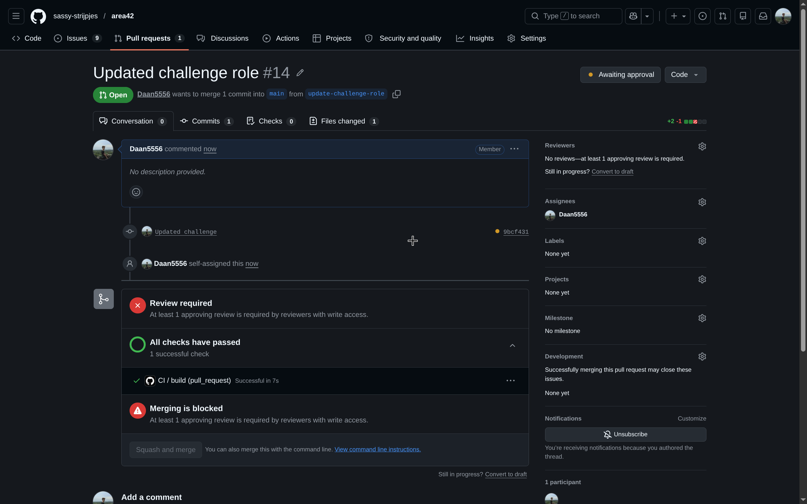
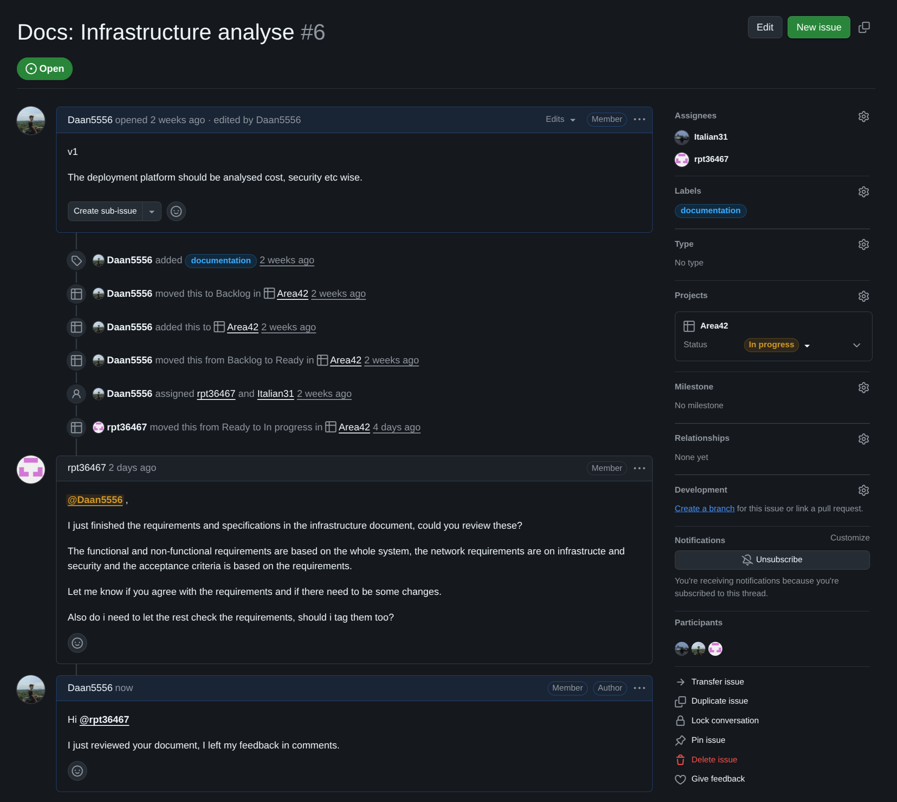
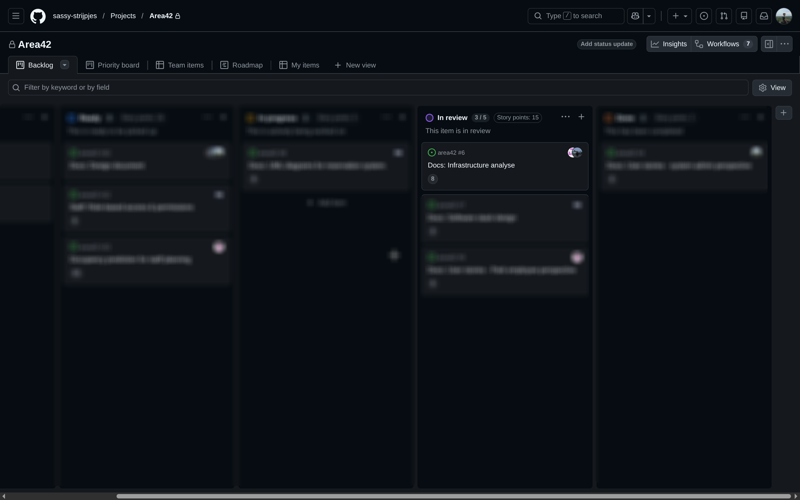
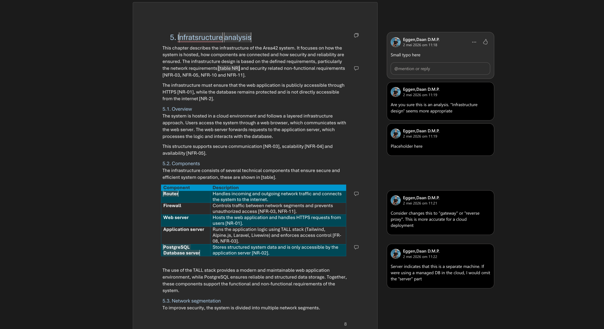

# Feedback process

**Author:** Daan Eggen  
**Date:** 16/05/2026  
**Version:** 1.0

---

To keep each other sharp during development, our group employed a rigorous
review process. For source code, this meant a automated pull request approver
process. Using our Git platform, (Github) we enforced a minimal approver amount
of one as you can see from the following picture.

In this pull request setup we can discus implementation details and learn from
each other. The more people that read the code, the more informed we are of the
project as a whole. This leads to more efficient discussions regarding
architecture in the future.

Other deliverables are also reviewed, like design documents. Every task in our
project has a Github issue. This provisions a way of communicating everything
regarding this specific component, as well as requesting reviews.

As you can see, our team members ping one or multiple people for a feedback
request, they also move the ticket in the `In review` column, so everybody can
track the status of that ticket.

Because this tickets' deliverable was a Word document. I left my review comments
in the Microsoft cloud environment.

