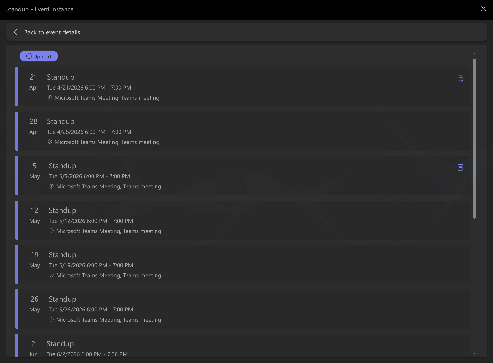
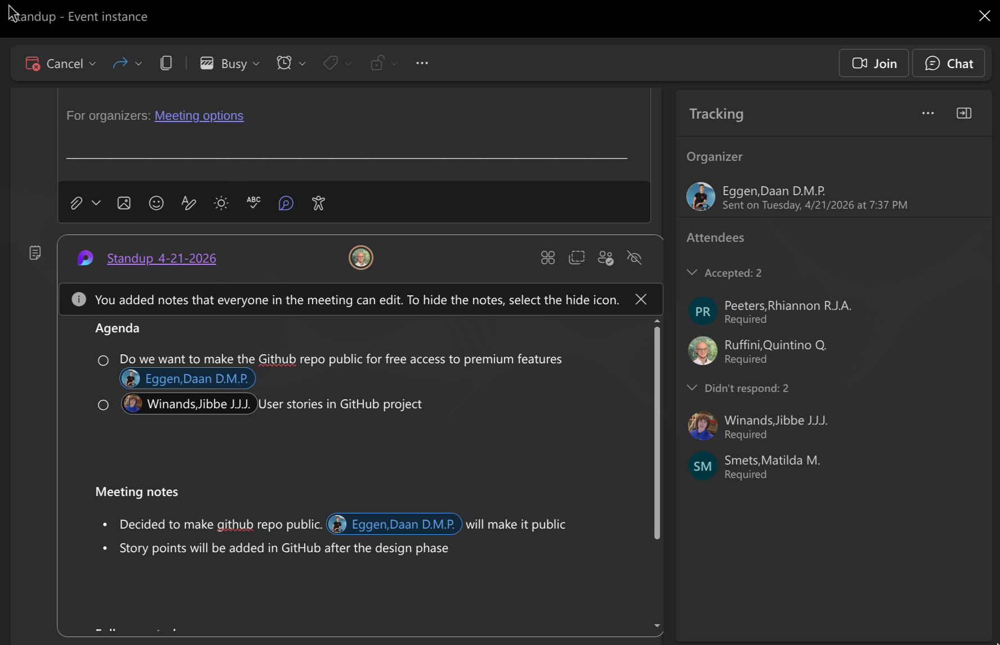
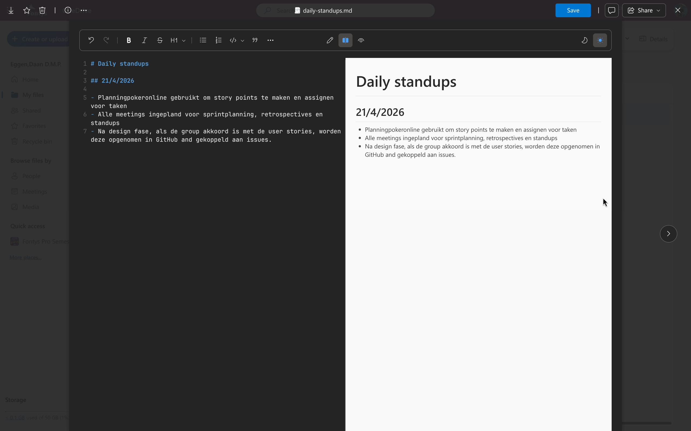
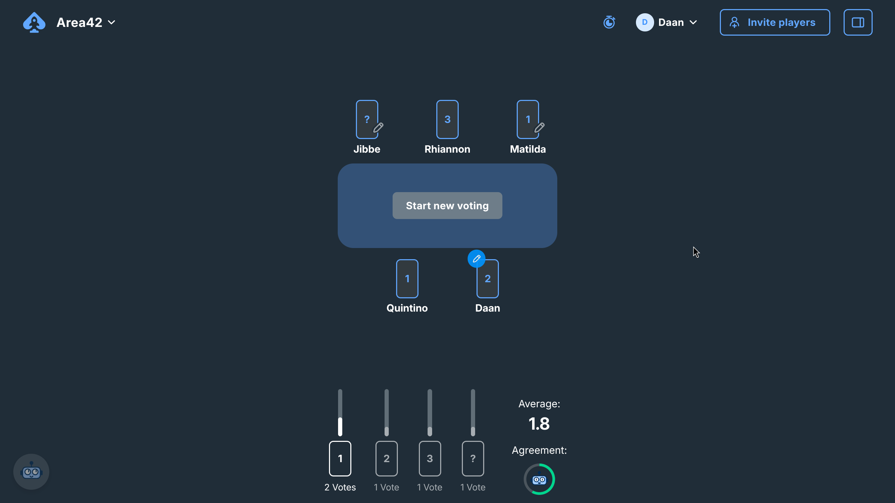
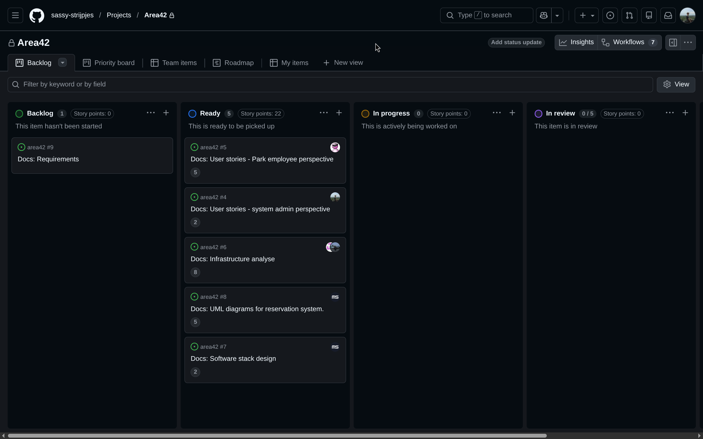

# Management project

**Author:** Daan Eggen  
**Date:** 19/04/2026  
**Version:** 1.0

---

This project we will be working with the Scrum method, and I will be tasked with
the duties of the Scrum Master. I want to make sure that we will have a non
blocked planning, and have good insight on progress. I will use the knowledge
which I obtained from my own workplace, where we also work with scrum, and in
addition, I will use online information resources like Atlassian[^atlassian].

## Meetings planning

Scrum consist of a couple of ceremonies. The ones we will be doing are the
following:

- Standup
- Sprint planning
- Retrospective

Because the project group will be together only once a week, the standup will
also be once week. I created an event in our Outlook calendar, so everyone knows
on any given day, what meetings will occur.

As you can see from the meeting details page, we have a space to maintain a list
of agenda points. This way, people can independently add new topic before the
meeting commences.

The topic and decisions made in this meeting are documented in a central file in
our shared OneDrive.

## Sprint planning

We will operate in sprints of 2 weeks. At the beginning of every sprint, we will
have a sprint planning meeting. This is where we take tickets from the backlog,
and collectively make a story point estimation. We will do this using planing
poker, this is where we look at a ticket, and without looking at each others
estimations, placing a card with our estimation on the table. This ensures no
one is influenced on their decision.

As you can see from this screenshot from our first sprint planning, we didn't
get a unanimous result while voting on a ticket.

This happend a couple of times actually. We didn't see this as a failure tough.
Instead, we would discuss the outliers, reason about our estimation, and in the
end, decided on a single decision. At the end of our planning meeting, we had
all of the tickets of the sprints we would be working on in the "ready" column,
and they are provided with a story point estimation.

## Sprint retrospective

After the first sprint, we can see how much story points we were able to
complete with a certain amount of people. We can then plan more accordingly. We
also have a working product at the end of the sprint, which we can use, demo and
give to our users. This feedback from using our product early, will help us
shape the project.

## Conclusion

With this system in place supporting our development, we will be assisted in our
planning and have a short feedback loop. The expectation is that this will cause
more efficient development and better decision making.

[^atlassian]:
    https://www.atlassian.com/agile/tutorials/how-to-do-scrum-with-jira
